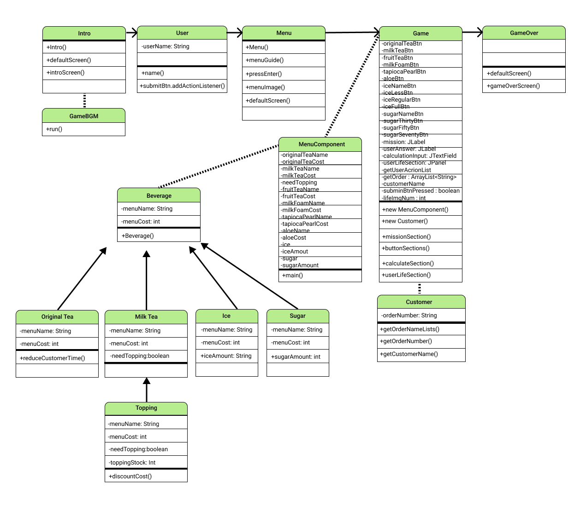
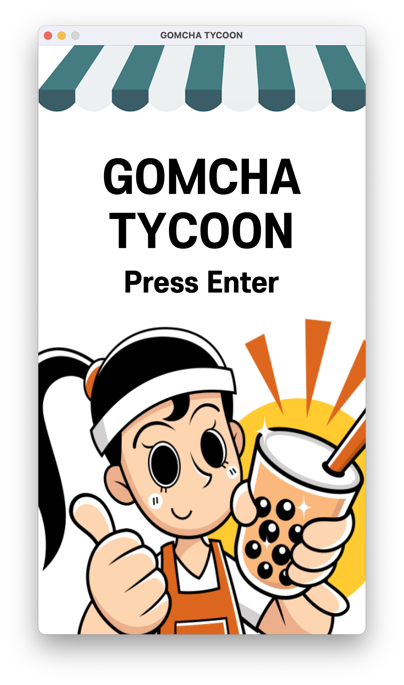
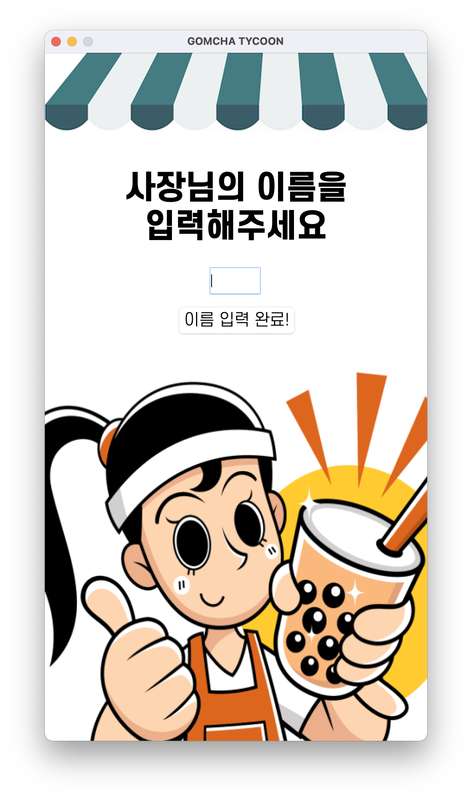

# 5-java-nk-gomcha-tycoon

## 📌 프로젝트명 - 곰차 타이쿤(GOMCHA TYCOON)

### 사용한 언어
  - Java  
### 프로젝트 설명
  - 곰차 타이쿤은 곰차를 방문한 손님으로부터 주문을 받아, 주문의 내용 및 순서에 맞게 버튼을 누르고  
총 가격까지 입력하여 주문 미션을 완료하는 시나리오로 구성되어 있습니다.
<br>


## 📌 폴더 구조 설명

```
└── src  
    ├── beverage_tycoon  
    │   ├── Intro.java  
    │   ├── Menu.java  
    │   ├── MenuComponent.java  
    │   ├── MenuGuide.java  
    │   ├── User.java  
    │   ├── Customer.java  
    │   ├── Game.java  
    │   ├── GameBGM.java  
    │   └── GameOver.java  
    └── bgm  
    │   └── tycoonBgm.wav  
    └── images  
        ├── tycoonCharacter.png 
        ├── tycoonMenu.png 
        ├── tycoonRoof.png 
        └── tycoonUserLife.png 
```

## 📌 주요 기능
- 엔터를 눌러 페이지 전환
- 사용자로부터 이름을 입력받아 출력하기 
- 무작위로 손님이 등장하여 랜덤으로 메뉴 주문하기
- 주문을 확인한 사용자가 버튼을 눌러 메뉴를 입력하고 가격을 입력하면 손님의 주문과 비교
- 유저의 입력이 20초를 넘어갈 경우 손님이 떠나고 목숨이 깎이며 다음 주문 받기
- 주문과 유저 입력이 같을 경우와 다를 경우(가격은 일치하나 주문이 틀린 경우 / 주문은 일치하나 가격이 틀린 경우 / 둘다 틀린 경우)  
모두 다른 결과가 출력되도록 구현
- 사용자가 오류를 범할 경우 사용자 목숨이 하나씩 깎이는 기능
- 목숨이 모두 소진되면 게임 오버 화면이 출력

## 📌 프로젝트 설계도


## 📌 문제점과 해결 방법
- 문제점 1  
  손님이 20초 뒤에 떠나기 전, 유저가 버튼을 입력했다면 실행 중이던 TimerTask 메소드를 멈춘 뒤, 다음 손님이 등장할 때 어떻게 다시 새로운 20초 TimerTask를 실행시킬 것인가?  
- 해결 방법  
  1-1. 손님이 버튼을 눌렀는 지 아닌 지를 판별하는 boolean 변수(submitBtnPressed)를 설정  
  1-2. 손님이 버튼을 누르면 해당 변수를 true로 변경하고 20초 TimerTask는 cancel()을 실행한다.  
      동시에 submitBtnPressed 변수는 false로 값을 변경한다. (이유: 다음 손님 방문 메소드 실행 시 20초 TimerTask도 똑같이 초기화 시키기 위함)  
  <br>
- 문제점 2  
  손님이 20초가 흘러 떠나고 난 뒤, 새로운 손님이 등장하는 메소드를 어디에 위치시킬 것인가?  
- 해결 방법  
  2-1. 20초를 체크하는 TimerTask 메소드에 손님 방문 메소드를 위치시키면, 첫 손님 방문 시 방문 창이 중첩되어 발생하는 이슈가 생긴다.  
  2-2. 20초가 지났다는 것은 유저의 목숨 값이 하나 줄어듦을 의미한다. 따라서 유저의 실패 뒤 손님 방문 메소드 실행은 유저 목숨값을 사라지게 하는 메소드에서 실행시킴이 옳다고 판단.  
  2-3. 잘 실행됨을 확인하였다!  
  <br>
- 문제점 3  
  손님 방문 메소드가 실행될 때마다 어떻게 새로운 손님의 주문 값을 받을 것인가?  
- 해결 방법    
  3-1. Game 클래스에서 Consumer 객체를 생성하고, 객체 생성자 내 변수로 선언된 주문값, 손님의 이름을 받으려니 매번 새로운 객체를 생성해야 했고, 결국 유저의 입력값과 손님 주문의 출력값이 매번 다른 이슈가 발생.  
  3-2. Consumer 객체 내 메소드를 가져와 변수에 할당하는 것으로 변경


## 📌 프로그램 구현 자료
### 프로그램 캡쳐 이미지 (이미지 개수: 4장 이상)
<p align="left">




</p>

### 프로젝트  영상
[유튜브링크]()

## 📌 추후에 코드 개선할 점들
- 중복되는 코드들(ex. defaultScreen 메소드)이 있습니다. 이는 상수 파일 처리해 import 받도록 수정하려고 합니다.
- 제3자가 보더라도 이해할 수 있도록 세부적인 주석 처리가 필요합니다. (ex. 왜 이미지 크기를 해당 숫자로 설정했는지 등)
- 메소드 명명법에 대해 다시 고민해야 할 것입니다. Section이라는 네이밍으로 메소드를 구현한 것은 좋은 명명법은 아니었다고 생각합니다.

## 📌 느낀점
1. 기능 구현이 자꾸 안되니까 집중력이 흐려져 변수명을 대충 짓고 있는 스스로를 발견. 아무리 피곤해도 미래의 나를 위해 변수명은 잘 챙깁시다.
2. 주석은 왜 쓰는가? 내가 왜 이렇게 코드를 썼는지 설명하기 위해서다. 자꾸 주석에다가 깨달은 부분에 대해 쓰지말고, 따로 정리해두자. 
3. 설계도 이거 쉽지 않은 거구나.. 프로젝트를 구현하면서 설계도랑 점점 거리가 멀어지는 걸 어떻게든 좁힐라고 용을 썼다. 다음에 설계도 짤 때는 좀 더 구조적으로 짜보도록 노력해보자.
4. 코드를 못짠다고 멍때리고 있을 여유가 없다. 요령과 아이디어를 생각해 구현만이라도 해낼 수 있도록 하자. 
5. 내가 짠 코드를 내가 조리있게 설명하지 못하는 순간 만큼 웃긴게 없다. 나중에 팀 프로젝트를 대비해 단어들이 입에 잘 붙게 틈틈히 연습해두자.
